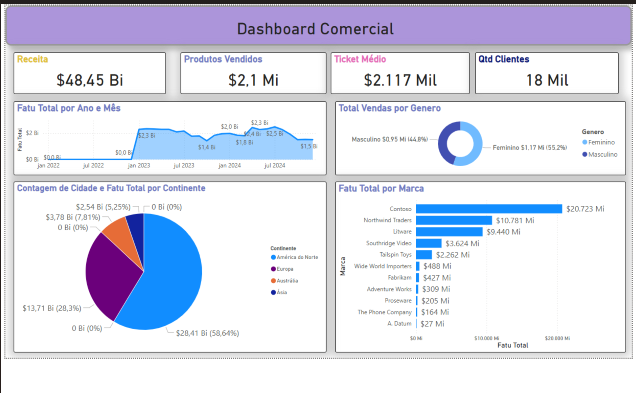
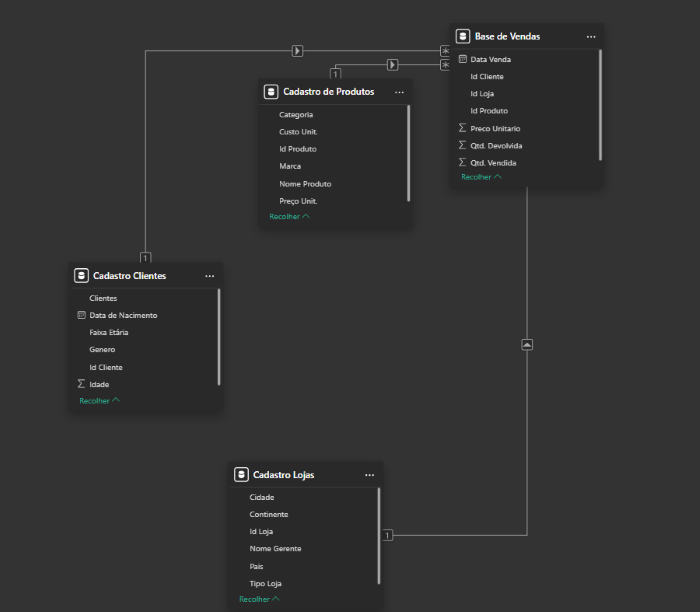

# 📊 Dashboard Comercial em Power BI

Este projeto consiste em um **Dashboard Comercial interativo** desenvolvido no **Power BI**, com o objetivo de fornecer uma análise detalhada sobre as vendas, receita, clientes e desempenho por marca e gênero. É uma visualização estratégica pensada para tomadas de decisão rápidas e eficientes.

---

## 🚀 Objetivo

Criar um painel visual que consolida dados comerciais, permitindo uma análise abrangente de indicadores como:
- Receita total
- Quantidade de produtos vendidos
- Ticket médio por cliente
- Quantidade de clientes únicos
- Faturamento por marca
- Análise de vendas por gênero
- Distribuição de receita por continente e cidade
- Evolução de vendas por ano e mês

---

## 📈 Principais Indicadores (KPIs)

| Indicador              | Valor         |
|------------------------|---------------|
| Receita Total          | $48,45 Bilhões |
| Produtos Vendidos      | 2,1 Milhões    |
| Ticket Médio           | $2.117 Mil     |
| Quantidade de Clientes | 18 Mil         |

---

## 📊 Visualizações Utilizadas

- **Cartões de KPI** para receita, produtos, clientes e ticket médio  
- **Gráfico de Linha** para evolução de faturamento por ano/mês  
- **Gráfico de Rosca** para vendas por gênero  
- **Gráfico de Pizza** para receita por continente e contagem de cidades  
- **Gráfico de Barras** para faturamento por marca  

---

## 🧾 Fonte dos Dados

Os dados utilizados foram extraídos da aba `Base de Vendas`, `Cadastro Clientes` e `Cadastro Produtos`.  
A estrutura dos dados foi tratada e modelada diretamente no Power BI.

---

## 🛠️ Recursos Utilizados

- Power BI Desktop  
- Modelagem de dados com relacionamento entre tabelas  
- Medidas DAX para cálculo de faturamento total, ticket médio e vendas por marca/gênero  
- Formatação condicional e paleta de cores amigável para melhor experiência visual  

---

## 🧩 Filtros Disponíveis

- Ano, Mês e Dia da Venda  
- Gênero do Cliente  
- Continente da Loja  
- Marca dos Produtos  
- Drill-through ativado para análise por cliente e produto  

---

## 🗂️ Estrutura das Tabelas

- **Base de Vendas:** contém dados de vendas com ID do cliente, ID do produto, data da venda, quantidade e valor.  
- **Cadastro Clientes:** dados demográficos como idade, faixa etária e gênero.  
- **Cadastro Produtos:** informações de marca, categoria e preço unitário.

---

## 💡 Insights Possíveis

- Identificar as marcas mais lucrativas  
- Comparar desempenho por gênero  
- Avaliar sazonalidade de vendas (por mês/ano)  
- Verificar distribuição geográfica da receita  
- Calcular ticket médio por cliente

---

## 🖼️ Print do Dashboard

---

## 📌 Como Abrir este Projeto

1. Baixe o arquivo `.pbix` do repositório.
2. Abra com o **Power BI Desktop** (versão mais recente).
3. Verifique se os dados estão conectados corretamente (caso utilize arquivos externos).
4. Interaja com os gráficos e filtros.

---

## 🧠 Aprendizados

Durante o desenvolvimento deste projeto, aprofundei meus conhecimentos em:

Power Query para tratamento e transformação dos dados antes da modelagem

Criação de medidas DAX para cálculo de KPIs e métricas de análise

Modelagem relacional entre tabelas com chaves primárias e estrangeiras

Design visual de dashboards com foco em clareza e insights rápidos

Interatividade com filtros, segmentações e drill-through

---

## 🧑‍💻 Autor

**Tatiana Kami**  
Desenvolvedora Python| Análise de Dados  
[LinkedIn](https://www.linkedin.com/in/Tatiana-Kami/) | [GitHub](https://github.com/Tatianakami)

---

